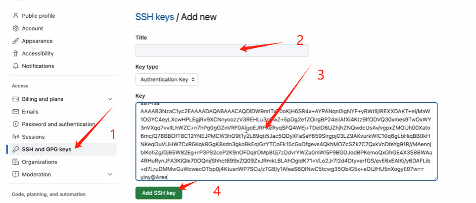

# Git基础操作教学

## 1 简介

### 1.1 为什么有Git

-   我们先看看现状
    -   当工程架构庞大, 当项目需要多人合作时, 传统的策略, 或者说小白的策略就是打包压缩
        -   网盘, QQ, 邮箱传输
    -   弊端
        -   很难支持多人同时开发
        -   最新版本的工程只保留在某个开发者的设备上
        -   每次移交给新的开发者需要对整个工程打包重传, 流量消耗巨大, 而且实时性差
        -   不易于版本管理
-   我们需要的功能
    -   支持多人同时开发, 保证高效有序
    -   有一个网络平台能帮我们同步工程开发进度
    -   差分增量式更新工程代码, 减少上传下载流量
    -   支持历史追踪的版本管理, 便于回溯

### 1.2 Git是什么

-   Git是一个**分布式版本控制系统**
    -   需要搭载在一个网络服务器上, 也需要部署在每个开发者的主机上
        -   网络服务器 ( 网络端, 远程 ) 
            -   国际通用的Github
                -   https://github.com
                -   个人免费用户单仓库最大1G, 单文件最大100M
                -   在中国大陆连接较不稳定
            -   中国大陆常见的Gitee
                -   https://gitee.com
                -   个人免费用户单仓库最大500M, 单文件最大50M
                -   连接较稳定, 但速度不是很乐观
            
            
            -   安装Git即可
            
            -   安装包下载
            
                -   官网https://git.scm.com可获取
            
            
    -   Git以**仓库**为单位管理自己的项目, 或者说工程代码
        
        -   本地代码 <-> 暂存区 <-> 本地仓库 <-> 远程仓库

## 2 Git的配置

### 2.1 用户端配置

#### 2.1.1 基本配置

-   本地端安装完成后, 右键任意一文件夹内空白处打开<kbd>Git bash here</kbd>进行配置

    ```bash
    # 配置用户名, 在电脑上提交代码用的就是这个信息
    # <your_name>是你的自定义用户名
    git config --global user.name "<your_name>"
    
    # 配置用户邮箱, 在电脑上提交代码用的就是这个信息
    # <your_email>是你的邮箱
    git config --global user.email "<your_email>"

    #永久配置储存
    git config --global credentials.helper store
    
    # 显示配置信息是否正确, 检查一下
    git config --list
    ```
- 如图所示
  
    

#### 2.1.2 密钥配置

>   密码学知识小科普
>
>   -   密钥
>       -   为了保证数据安全, 我们要做的努力包括但不限于: 保护信源信宿 ( 发送方接收方 ) , 保护信道, 保护信息
>       -   给信息加密就是保护信息的一个方法, 保证信道上传输的内容不是明文而是密文
>       -   加解密算法中, 参与处理信息, 将明文转换为密文的关键就是密钥, 按种类分为对称密钥和非对称密钥
>   -   对称密钥
>       -   通信双方知晓的密钥
>       -   双方保存相同的密钥
>       -   一旦泄露则不安全
>       -   最经典的对称密钥: 凯撒密码
>           -   密钥是3, 也就是把字母表循环往后挪三位
>           -   <kbd>abcxyz</kbd>加密后是<kbd>defabc</kbd>
>   -   非对称密钥
>       -   分为公钥和私钥, 由通信一方或可信第三方生成后分发, 属于某个个体
>       -   所有者拥有公钥和私钥
>       -   公钥可以随意发布, 私钥一定要保密
>       -   最经典的非对称密钥: RSA密钥
>           -   可靠性依赖数论上的经典难题 " 大质数分解 " , 若该难题攻克, 即多项式时间内可将任意大质数分解, 则该算法将不再安全. 关于数学相关内容, 感兴趣同学可自行了解
>           -   根据算法生成三个大数 $$(e, d, n)$$ , 这三个数均至少为1024bit, 公钥是 $$(e, n)$$ , 私钥是 $$(d, n)$$ , 满足任意一个数 $$x$$ , 都有  $$x^{ed} = 1 \mod n$$ 
>           -   使用方法, 假设A是拥有者, 待处理数据是 $$x$$
>               -   加密, B向A发数据
>                   -   B用公钥处理 $$x$$ , 即 $$y = x^e \mod n$$ , 向A发送 $$y$$ 
>                   -   A收到后, 用私钥处理 $$y$$ , 即 $$x = y^d \mod n$$ , 恢复出 $$x$$ , 得到B发的信息
>               -   签名
>                   -   A用私钥处理 $$x$$ , 即 $$y = x^d \mod n$$ , 向B发送 $$y$$ 
>                   -   B收到后, 用公钥处理 $$y$$ , 即 $$x = y^e \mod n$$ , 恢复出 $$x$$ , 认为这条数据来源于A
>           -   应用场景: 身份验证
>               -   B用公钥加密数据发给A
>               -   A用私钥解密数据返回给B
>               -   B比对返回的数据和B加密的数据是否一致, 从而验证A的身份

-   右键任意处打开<kbd>Git bash here</kbd>进行配置

    ```bash
    #先到系统存储秘钥文件夹处
    #若无可在根目录之上直接
    #mkdir .ssh/
    cd .ssh/
    # 生成ssh密钥, 后续具体密钥配置内容请同学们按需填写
    # <your_email>是你的邮箱
    ssh-keygen -t rsa -b 4096 -C "<your_email>"
    ssh-keygen -t rsa -b 4096
    ```
- 如下图所示


- 一直enter直至以下页面出现即可
   


-   到此, 我们完成了对本地端的配置

### 2.2 网络端配置

#### 2.2.1 注册

-   不多赘述, 请同学们自行注册

#### 2.2.2 密钥配置

-   将本地生成的**公钥文件**内容以文本形式粘贴到远程的个人账号中

    -   私钥文件在 <kbd>~/.ssh/id_rsa</kbd>
    -   公钥文件在 <kbd>~/.ssh/id_rsa.pub</kbd>
  
      ```bash
    #直接cat ~/.ssh/id_rsa.pub即可
    cat ~/.ssh/id_rsa.pub

    ```
    -    出现下图,然后复制
    

    -   不同平台的账号配置位置, 可以通过主页进入, 这里为了方便直接挂链接了
        -   本次培训以**Gitee**为例, 其他平台操作类似
        -   Github
            -   https://github.com/settings/keys
        -   Gitee
            -   https://gitee.com/profile/sshkeys

    - 按照下图操作即可
    

    >   当我们需要向远程仓库推送修改过的工程代码时, Git程序会利用本地的私钥与远程配置的公钥来对我们进行身份验证
    >   若验证通过, 则同意一些对远程仓库的关键操作

-   到此, 我们完成了对网络端的配置

## 3 仓库的使用与基本操作

​		接下来就要思考一个问题, 我们是否在远程存在一个仓库

​		如果是自己的项目, 而且是自己第一次学习Git, 这个仓库大概率是没有的. 但如果你新加入了一个团队, 比如战队的电控组, 那么你需要上手的项目大概率是有一个仓库的, 当然你还需要确认自己有这个仓库的权限, 否则后面一系列的操作都无法执行

​		本人建议各位同学都需要看一看3.1, 从一个空项目开始练练手. 但针对前者, 请从3.1开始操作; 针对后者, 请从3.2开始操作即可

​		在操作开始之前先带大家讲一讲相关的概念

>   git的流程
>
>   -   本地进行开发代码
>   -   将开发过程修改的代码记录放到本地的暂存区 ( git add )
>   -   将暂存区的代码改动记录呈递到本地仓库 ( git commit )
>   -   而后将本地仓库的代码改动同步到远程仓库完成一轮推送 ( git push )
>
>   仓库
>
>   -   存储代码的一个存储区, 分为两种, 一种是远程仓库, 一种是本地仓库
>
>   暂存区
>
>   -   暂存临时修改代码的存储区, 在本地
>
>   分支
>
>   -   一个仓库可以有多个分支, 和仓库一样, 远程仓库有远程分支, 本地仓库有本地分支
>   -   如果代码开发了一个较复杂且独立的新功能时, 需要创建分支进行开发, 测试通过后进行合并
>   -   每个仓库都有一个默认分支, 一般叫做master或者main
>   -   对于RoboMaster电控的环境, 开发难度低且上手容易, 大概率用不到分支, 直接在默认的主分支里开发即可
>
>   上面那些理解不了也没事, 后面随着开发的时候遇到了再回过头看也行

### 3.1 如果没有仓库

#### 3.1.1 远程仓库的创建

-   在代码主页点击<kbd>新建仓库</kbd>

    

-   初始化仓库并生成

    

#### 3.1.2 本地仓库的配置

-   右键你想存放仓库的路径, 打开<kbd>Git bash here</kbd>进行配置

    ```bash
    # 初始化生成Git仓库, 此操作会生成一个.git的文件夹, 用于存放git的相关配置信息
    git init
    
    # 将远程仓库链接到本地, 而且仅仅是链接, 不做任何下载上传操作
    # <your_repository_url>是你的链接
    git remote add origin <your_repository_url>
    
    # 从远程仓库的分支拉取
    # <your_branch>是远程仓库的分支名称, 一般是master或者main
    git pull origin <your_branch>
    
    # 使能大小写敏感选项, 防止路径文件出现差错
    git config core.ignorecase false
    ```

    

-   添加<kbd>.gitignore</kbd>文件

    -   顾名思义, 在git的时候会忽略掉里面包含的文件

        -   作用
            -   保护关键文件不被修改
            -   防止不必要的大文件占用仓库资源的作用
                -   开发环境记录文件
                -   编译中间生成文件
                -   本地日志文件
        -   是个纯文本文件
            -   以换行回车分割不同的条目, 每条是文件或者文件夹的路径
            -   路径的详细说明
                -   以<kbd>/</kbd>开头则<kbd>.gitignore</kbd>文件所在目录下的文件夹适配该条规则, 否则<kbd>.gitignore</kbd>文件所在目录以及其子目录均适配
                -   以<kbd>/</kbd>结尾表示适配该条规则的为文件夹, 否则为文件
                -   \*是任意数量个字符通配符
                -   ?是一个字符通配符
                -   \*\*是任意文件夹路径通配符
            -   如果不想忽略某个被ignore的路径下的某文件, 可在该文件前加<kbd>!</kbd>
            -   以<kbd>#</kbd>开头的是注释
            -   <kbd>.gitignore</kbd>可以放置到工程中的任一路径, 则规则对该路径的全部文件和文件夹起作用

    -   一般情况下, 单片机嵌入式代码的模板如下

        ```bash
        # 所有的一般可执行文件
        /**/*.exe
        
        # KeilIDE编辑器忽略项
        /**/MDK-ARM/*
        # 不忽略Keil工程配置文件
        !/**/MDK-ARM/*.uvoptx
        !/**/MDK-ARM/*.uvprojx
        !/**/MDK-ARM/startup_*.s
        
        # armgcc-cmake工程忽略项
        /**/cmake-build-debug
        
        # VsCode编辑器忽略项
        /**/.vscode
        /**/workspace.code-workspace
        
        # Clion编辑器忽略项
        /**/.idea
        ```

    

    -   关于更多gitignore相关内容, 可以自行在网上查询了解

-   上述流程完成后, 即可对代码进行开发了

### 3.2 如果已有仓库

#### 3.2.1 邀请协作者

-   按照如图所示操作, 可对仓库成员添加, 这样该成员就有对仓库的对应权限了


#### 3.2.2 克隆远程仓库到本地

-   右键你想存放仓库的路径, 打开<kbd>Git bash here</kbd>进行配置

    ```bash
    # 直接将远程仓库克隆到本地, 此操作会生成仓库对应的文件夹, 文件夹里有.git的文件夹, 用于存放git的相关配置信息. 
    # <your_repository_url>是你远程仓库的地址
    git clone <your_repository_url>
    ```

    

-   上述流程完成后, 即可对代码进行开发了

### 3.3 代码推送

-   当你完成了一个功能, 并**测试通过**, 即可进行推送代码, 推送代码前记得同步远程的最新代码仓库, 即再次执行下面的命令

    ```bash
    # 从远程仓库的分支拉取
    # <your_branch>是远程仓库的分支名称, 一般是master或者main
    git pull origin <your_branch>
    ```

    

-   右键本地仓库<kbd>.git</kbd>文件所在的路径, 打开<kbd>Git bash here</kbd>进行配置

    ```bash
    # 将自己编写的代码加入暂存区
    git add .
    
    # 将暂存区的代码添加到本地仓库, 并添加自己对该修改的注释
    # <your_description>是你的描述, 比如新增某某功能, 或修复某某bug
    git commit -m "<your_description>"
    
    # 向远程仓库的分支推送
    # <your_branch>是远程仓库的分支名称, 一般是master或者main
    git push origin <your_branch>
    ```

    

-   如果用的是Github或USTCLUG-Gitlab, 执行最后一条指令时会报出<kbd>error: failed to push some refs to "<your_repository_url>"</kbd>的错误, 
  

    -   原因: 我们本地的Git默认主分支的名称是master, 但远程仓库的默认主分支名称为main, 导致本地仓库与远程仓库的分支之间名称不同, 进而代码推送出问题

    -   解决方法: 修改本地分支名, 执行如下指令

        ```bash
        # 将本地分支master名称修改为main
        git branch -m master main
        ```


## 4 VsCode下使用Git

-   根据我的个人习惯, 建议各位初始化仓库或第一次从远程拉取仓库时使用命令行而非VsCode. 当然大家随意

-   VsCode会自动寻找其工作路径下 ( 就是你右键打开的文件夹 ) 以及上级文件夹下的第一个<kbd>.git</kbd>文件, 并作为当前项目的文件


-   此后, 修改的所有代码都会在<kbd>源代码管理</kbd>中显示, 可点击每个文件以只读模式查看你做的修改, 每个文件右侧的<kbd>+</kbd>可以将文件暂存到暂存区, 输入描述性文本展示你所做的更改后, <kbd>Ctrl</kbd>+<kbd>Enter</kbd>提交到本地仓库, 而后点击<kbd>同步更改</kbd>即可同步到远程远程仓库


-   还有很多很多其他功能, 各位可以自行探索一下

## 5 总结

​		恭喜你掌握了Git的基本使用方法. 不过正如大家所见, 我讲的内容, 某种程度上不一定是绝对标准或者完全规范的做法. 除此之外, Git上面也有很多功能我没有用到 ( 冲突合并, 分支签入签出, pull request )

​		但是, 这里面的操作, 已经足够上手对RM的代码, 以及绝大多数网上的开源项目进行开发了. 对于较大或者说较官方的项目, 前面的路还长, 还是要学习一些更多的内容. 不过遇到了再学也是来得及的, 只需要自己有一定的查询搜索引擎能力就可以

​		修行在个人, 授人以渔不如授之以渔

-   Git从入门到精通
    -   https://detail.tmall.com/item.htm?abbucket=11&id=610816649050&ns=1&spm=a21n57.1.0.0.7967523cr3SQ59

-   GitHub入门与实践
    -   https://detail.tmall.com/item.htm?abbucket=11&id=549123908094&ns=1&spm=a21n57.1.0.0.7967523cr3SQ59

## 6 致谢
本教程参考了中科大大佬的git教程，感谢大佬的无私开源。